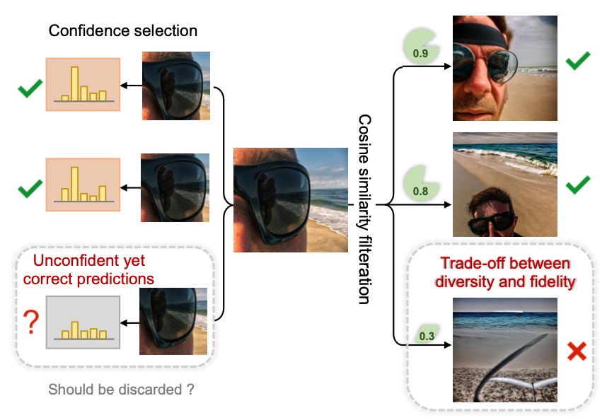
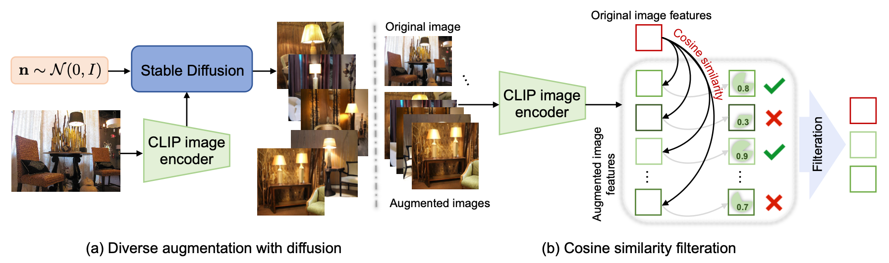

# 【ICCV 2023】 Diverse Data Augmentation with Diffusions for Effective Test-time Prompt Tuning

This repo is the official implementation of [DiffTPT](https://arxiv.org/abs/2308.06038).

## Abstract
Benefiting from prompt tuning, recent years have witnessed the promising performance of pre-trained vision-language models, e.g., CLIP, on versatile downstream tasks. In this paper, we focus on a particular setting of learning adaptive prompts on the fly for each test sample from an unseen new domain, which is known as test-time prompt tuning (TPT). Existing TPT methods typically rely on data augmentation and confidence selection. However, conventional data augmentation techniques, e.g., random resized crops, suffers from the lack of data diversity, while entropy-based confidence selection alone is not sufficient to guarantee prediction fidelity. To address these issues, we propose a novel TPT method, named DiffTPT, which leverages pre-trained diffusion models to generate diverse and informative augmented data. Specifically, we incorporate augmented data by both conventional method and pre-trained stable diffusion to exploit their respective merits, improving the model’s ability to adapt to unknown new test data. Moreover, to ensure the prediction fidelity of generated data, we introduce a cosine similarity-based filtration technique to select the generated data with higher similarity to the single test sample. Our experiments on test datasets with distribution shifts and unseen categories demonstrate that DiffTPT improves the zero-shot accuracy by an average of 5.13% compared to the state-of-the-art TPT method.

## Motivation

<div align="center">
    
</div>

## Framework

<div align="center">
    
</div>


## Get started

### Installation

* We adopt [generative-robustness](https://github.com/Hritikbansal/generative-robustness?utm_source=catalyzex.com) enviroment as our dependency.
```bash
# Clone this repo
git clone https://github.com/chunmeifeng/DiffTPT.git
cd DiffTPT

# Create a conda enviroment
1. conda env create -f environment.yml
2. conda activate difftpt
3. pip install torch==1.13.0+cu117 torchvision==0.14.0+cu117 torchaudio==0.13.0+cu117 -f https://download.pytorch.org/whl/torch_stable.html
4. accelerate config
- This machine
- multi-GPU
- (How many machines) 1
- (optimize with dynamo) NO
- (Deepspeed) NO
- (FullyShardedParallel) NO
- (MegatronLM) NO
- (Num of GPUs) 5
- (device ids) 0,1,2,3,4
- (np/fp16/bp16) no
```

### Datasets
We evaluate our method in two Scenarios:
1. S<sub>1</sub>: Natural Distribution Shifts
    * ImageNet
    * ImageNet-V2
    * ImageNet-A
    * ImageNet-R
    * ImageNet-Sketch
2. S<sub>2</sub>: Cross-Datasets Generalization
    * Flower102
    * OxfordPets
    * SUN397
    * DTD
    * Food101
    * StanfordCars
    * Aircraft
    * UCF101
    * EuroSAT
    * Caltech101

* Please refer to [CoOp/CoCoOp](https://github.com/KaiyangZhou/CoOp) and [TPT](https://github.com/azshue/TPT) for more details on data.


### How to Run
1. Stable Diffusion based data augmentation
```bash
# for ImageNet-R
accelerate launch --num_cpu_threads_per_process 8 -m image_generator_R --data_dir your_data_set_path/imagenet-r --save_image_gen your_output_data_path/imagenet-r_1k
```
* Please refer to [generative-robustness](https://github.com/Hritikbansal/generative-robustness?utm_source=catalyzex.com) for more details.

2. DiffTPT
```bash
bash scripts/do_tpt_difftpt.sh
```

## Citation

```  
  @article{feng2023diverse,
    title={Diverse Data Augmentation with Diffusions for Effective Test-time Prompt Tuning},
    author={Feng, Chun-Mei and Yu, Kai and Liu, Yong and Khan, Salman and Zuo, Wangmeng},
    journal={arXiv preprint arXiv:2308.06038},
    year={2023}
    }
```

## Acknowledgements

We extend our appreciation to the developers of the [CoOp/CoCoOp](https://github.com/KaiyangZhou/CoOp) and [TPT](https://github.com/azshue/TPT) project for sharing their open-source implementation and providing guidance on preparing the data.
