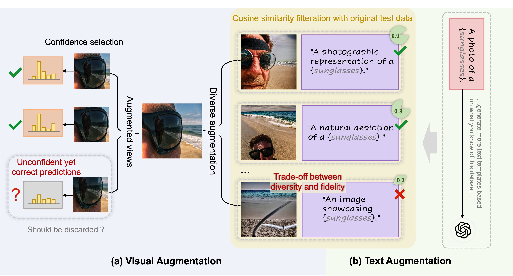
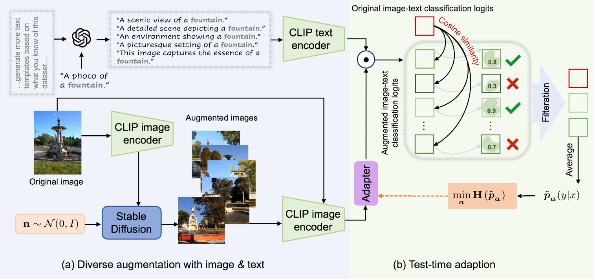

# 【IJCV 2025】 Diffusion-Enhanced Test-time Adaptation with Text and Image Augmentation

This repo is the official implementation of [IT3A](https://arxiv.org/abs/2412.09706).

## Abstract
Existing test-time prompt tuning (TPT) methods focus on single-modality data, primarily enhancing images and using confidence ratings to filter out inaccurate images. However, while image generation models can produce visually diverse images, single-modality data enhancement techniques still fail to capture the comprehensive knowledge provided by different modalities. Additionally, we note that the performance of TPT-based methods drops significantly when the number of augmented images is limited, which is not unusual given the computational expense of generative augmentation. To address these issues, we introduce IT3A, a novel test-time adaptation method that utilizes a pre-trained generative model for multi-modal augmentation of each test sample from unknown new domains. By combining augmented data from pre-trained vision and language models, we enhance the ability of the model to adapt to unknown new test data. Additionally, to ensure that key semantics are accurately retained when generating various visual and text enhancements, we employ cosine similarity filtering between the logits of the enhanced images and text with the original test data. This process allows us to filter out some spurious augmentation and inadequate combinations. To leverage the diverse enhancements provided by the generation model across different modals, we have replaced prompt tuning with an adapter for greater flexibility in utilizing text templates. Our experiments on the test datasets with distribution shifts and domain gaps show that in a zero-shot setting, IT3A outperforms state-of-the-art test-time prompt tuning methods with a 5.50% increase in accuracy.

## Motivation

<div align="center">
    
</div>

## Framework

<div align="center">
    
</div>


## Get started

### Installation

* We adopt [generative-robustness](https://github.com/Hritikbansal/generative-robustness?utm_source=catalyzex.com) enviroment as our dependency.
```bash
# Clone this repo
git clone https://github.com/chunmeifeng/DiffTPT.git
cd DiffTPT/IT3A

# Create a conda enviroment
1. conda env create -f environment.yml
2. conda activate difftpt
3. pip install torch==1.13.0+cu117 torchvision==0.14.0+cu117 torchaudio==0.13.0+cu117 -f https://download.pytorch.org/whl/torch_stable.html
4. accelerate config
- This machine
- multi-GPU
- (How many machines) 1
- (optimize with dynamo) NO
- (Deepspeed) NO
- (FullyShardedParallel) NO
- (MegatronLM) NO
- (Num of GPUs) 5
- (device ids) 0,1,2,3,4
- (np/fp16/bp16) no
```

### Datasets
We evaluate our method in two Scenarios:
1. S<sub>1</sub>: Natural Distribution Shifts
    * ImageNet
    * ImageNet-V2
    * ImageNet-A
    * ImageNet-R
    * ImageNet-Sketch
2. S<sub>2</sub>: Cross-Datasets Generalization
    * Flower102
    * OxfordPets
    * SUN397
    * DTD
    * Food101
    * StanfordCars
    * Aircraft
    * UCF101
    * EuroSAT
    * Caltech101

* Please refer to [CoOp/CoCoOp](https://github.com/KaiyangZhou/CoOp) and [TPT](https://github.com/azshue/TPT) for more details on data.


### How to Run
1. Stable Diffusion based data augmentation
```bash
# for ImageNet-R
accelerate launch --num_cpu_threads_per_process 8 -m image_generator_R --data_dir your_data_set_path/imagenet-r --save_image_gen your_output_data_path/imagenet-r_1k
```
* Please refer to [generative-robustness](https://github.com/Hritikbansal/generative-robustness?utm_source=catalyzex.com) for more details.
* Please note that number of generations are different in DiffTPT and IT3A. Please kindly follow the setting in corresponding paper.

2. IT3A
```bash
bash IT3A/scripts/do_it3a.sh
```

## Citation

```  
@article{feng2024diffusion,
  title={Diffusion-Enhanced Test-time Adaptation with Text and Image Augmentation},
  author={Feng, Chun-Mei and He, Yuanyang and Zou, Jian and Khan, Salman and Xiong, Huan and Li, Zhen and Zuo, Wangmeng and Goh, Rick Siow Mong and Liu, Yong},
  journal={arXiv preprint arXiv:2412.09706},
  year={2024}
}
```

## Acknowledgements

We extend our appreciation to the developers of the [CoOp/CoCoOp](https://github.com/KaiyangZhou/CoOp) and [TPT](https://github.com/azshue/TPT) project for sharing their open-source implementation and providing guidance on preparing the data.
